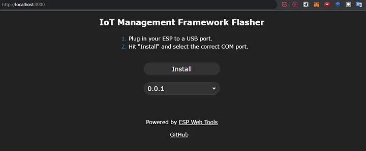

# machinemind
machinemind is an attemppt to create a modular unified hardware and software framework to make deploying industrial iot easy
https://www.canva.com/design/DAFgTs_lcFs/U2iWc2f2AEpBohQeeZKzwQ/view?utm_content=DAFgTs_lcFs&utm_campaign=designshare&utm_medium=link&utm_source=publishsharelink

#swbackend
Developing and deploying to IoT devices has always been a huge pain, flashing microcontrollers individually, then testing and debugging them individually dealing with a lot of IPs, getting confused in where is the problem exactly and then reflashing all the mcus one by one again has always been a painful process. And also controlling multiple nodes and monitoring them has always been a tedious task requiring complex frameworks and protocols.

This Framework has been designed in such a way that all you have to do is flash a single firmware on all your devices using a website which uses javascript for flashing also not requiring you to setup any development toolchains too.

Once after flashing you can configure your devices and make them connect to a wifi network or internet(not supported yet), and then talk to all of them using a single API.

With the API, you can reflash the mcus wirelessly, access the filesystem, change wifi config, monitor variables, change config variables, monitor serial output, monitor device health and many more possibilities.

The framework has been based on https://github.com/maakbaas/esp8266-iot-framework, with maakbaas’s framework you could do some operations while connecting to the device’s wifi ap. I have done some modifications on the framework and designed a central API that connects with all the devices and allows you to integrate this API anywhere and use it to expedite the process of IoT development.

The API and the framework currently only supports esp8266 and will be extended for other wifi-based mcus like esp32, pi pico w.

The API currently has the following endpoints-

/listdevices- lists the esp devices on the network
/<device>/uploadbin- upload binaries for flashing on the device
/<device>/variable/<method>- access the variables you defined for monitoring on the device, supports 2 methods list variables and get variable
/<device>/config/<method>- access the config variables you defined for monitoring on the device, supports 3 methods list variables, get variable and change variable
/<device>/healthstatus- monitor health parameters of the device
/<device>/files/<method>- has 3 methods list files, get a file and upload a file, used to manage a device’s filesystem
/<device>/serialout- get the serial output of any device
The API is in development right now and not complete yet, separate features have been tested and have been working just the consolidation is left as of now into the main API.

This API can make the work of IoT development very easy by making the process of developing, deploying, and testing very easy and also API can also be used to make IoT systems very easily without the knowledge of complex frameworks and protocols.
